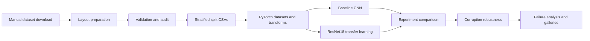

# Plant Disease VisionOps

A production-style computer vision workflow for 38-class plant disease image classification. The
project goes beyond clean test accuracy: it audits local data, creates reproducible split metadata,
trains comparable CNN and ResNet18 experiments, measures synthetic corruption robustness, and
turns individual errors into reviewable reports and image galleries.

> **Scope:** This is an engineering and evaluation portfolio, not a medical or agricultural
> diagnostic tool. It has not been validated on real field images and should not guide treatment.

## Key Results

The reported experiments use 175,734 valid, curated leaf images and a deterministic 70/15/15
stratified split.

| Experiment | Test accuracy | Test macro F1 |
|---|---:|---:|
| Baseline CNN, 3 epochs | 0.9154 | 0.9146 |
| ResNet18 transfer, 3 epochs | **0.9839** | **0.9838** |

The clean ResNet18 result is strong, but robustness testing changes the conclusion:

| ResNet18 condition | Accuracy | Macro F1 | Macro F1 drop |
|---|---:|---:|---:|
| Clean test split | 0.9839 | 0.9838 | 0.0000 |
| Brightness decrease, severity 3 | 0.3086 | 0.3286 | 0.6553 |
| Zoom in, severity 3 | 0.3754 | 0.4022 | 0.5816 |
| Contrast decrease, severity 3 | 0.5021 | 0.4895 | 0.4943 |
| Gaussian noise, severity 3 | 0.5947 | 0.5632 | 0.4207 |
| Gaussian blur, severity 3 | 0.6742 | 0.6758 | 0.3081 |

Average macro F1 across all 21 corrupted conditions was **0.8150**. Clean failure analysis found
425 mistakes among 26,353 test images (1.61%); severe brightness reduction produced 18,220 mistakes
(69.14%). These gaps, rather than the headline clean score, are the main project finding.

Results are reproduced from the committed JSON reports; evaluation was not rerun to write this
README. See the [final project summary](reports/final_project_summary.md) for interpretation.

## Failure Galleries

The repository includes compressed copies of the generated visual diagnostics. The original
full-resolution figures remain local and Git-ignored.

- [Clean test misclassifications](reports/assets/resnet18_transfer_3ep_failures_clean.jpg)
- [Brightness decrease severity 3 misclassifications](reports/assets/resnet18_transfer_3ep_failures_brightness_decrease_s3.jpg)

On clean data, frequent errors occur between visually related labels such as Tomato Target Spot and
Tomato Early Blight. Under severe darkening, predictions collapse heavily toward Tomato Late
Blight, revealing a systematic acquisition sensitivity that aggregate clean metrics conceal.

## Pipeline



### What Is Implemented

- Safe preparation and validation for flat or nested class-folder datasets
- Corrupt-image detection, image-size statistics, and class-imbalance audit
- Deterministic class-stratified train/validation/test metadata with leakage checks
- Typed, CSV-backed PyTorch datasets, train/evaluation transforms, and DataLoader factories
- Batch visualization without training
- Compact baseline CNN and ImageNet-pretrained ResNet18 experiment workflows
- Accuracy, macro F1, per-class metrics, confusion matrices, checkpoints, and history logging
- Seven deterministic corruptions at three severities
- Prediction-level confidence, confusion, class-error, and visual failure analysis
- Fast tests using generated toy images without real data, GPU, or network access

FastAPI, Streamlit, drift monitoring, and production deployment are deliberately outside the current
scope.

## Dataset Snapshot

| Item | Value |
|---|---:|
| Classes | 38 |
| Valid images | 175,734 |
| Invalid images | 0 |
| Train | 123,019 |
| Validation | 26,362 |
| Test | 26,353 |
| Image size | 256 x 256 |
| Class count ratio, max/min | 1.23 |
| Filepath overlap across splits | 0 |

Data is never downloaded automatically. `data/`, model checkpoints, and generated full-size figures
are excluded from Git.

## Repository Structure

```text
plant-disease-visionops/
├── src/plant_disease_visionops/
│   ├── data/          # discovery, audit, layout, splits, datasets, transforms
│   ├── models/        # baseline CNN and ResNet18 factory
│   ├── training/      # experiment engine, checkpoints, reporting
│   └── evaluation/    # metrics, comparison, robustness, failure analysis
├── tests/             # temporary toy-data unit and CLI tests
├── reports/           # committed metrics, analyses, model card, documentation
├── data/              # local dataset and generated split metadata, Git-ignored
└── artifacts/         # local checkpoints and full-size figures, Git-ignored
```

## Quickstart

Python 3.11 or newer is required.

```bash
python3 -m venv .venv
source .venv/bin/activate
python -m pip install -e ".[dev]"
```

Place a manually downloaded dataset under `data/external/`, prepare it if nested, then validate it:

```bash
python -m plant_disease_visionops.data.prepare_raw_layout \
  --input-dir data/external/plant_village \
  --output-dir data/raw \
  --mode copy

python -m plant_disease_visionops.data.validate_layout --data-dir data/raw
```

If images are already direct children of `data/raw/<class_name>/`, skip preparation.

Audit and create deterministic splits:

```bash
python -m plant_disease_visionops.data.audit_dataset \
  --data-dir data/raw --out-dir reports

python -m plant_disease_visionops.data.make_splits \
  --data-dir data/raw --out-dir data/processed --reports-dir reports \
  --train-ratio 0.7 --val-ratio 0.15 --test-ratio 0.15 --seed 42

python -m plant_disease_visionops.data.inspect_batch \
  --raw-data-dir data/raw --processed-dir data/processed \
  --split train --batch-size 8 --image-size 128 \
  --out-dir artifacts/figures
```

## Reproduce Experiments

Train the baseline:

```bash
python -m plant_disease_visionops.training.train_baseline \
  --raw-data-dir data/raw --processed-dir data/processed \
  --out-dir artifacts/models/baseline_cnn_3ep \
  --reports-dir reports --figures-dir artifacts/figures \
  --image-size 128 --batch-size 16 --epochs 3 \
  --learning-rate 0.001 --num-workers 2 --seed 42
```

Train ResNet18 with ImageNet initialization and full fine-tuning:

```bash
python -m plant_disease_visionops.training.train_experiment \
  --model-name resnet18 --experiment-name resnet18_transfer_3ep \
  --pretrained true --freeze-backbone false \
  --raw-data-dir data/raw --processed-dir data/processed \
  --out-dir artifacts/models/resnet18_transfer_3ep \
  --reports-dir reports --figures-dir artifacts/figures \
  --image-size 128 --batch-size 16 --epochs 3 \
  --learning-rate 0.0003 --num-workers 2 --seed 42
```

Compare, stress-test, and inspect the saved local checkpoint:

```bash
python -m plant_disease_visionops.evaluation.compare_experiments \
  --reports-dir reports \
  --out-md reports/experiment_comparison.md \
  --out-json reports/experiment_comparison.json

python -m plant_disease_visionops.evaluation.evaluate_robustness \
  --checkpoint artifacts/models/resnet18_transfer_3ep/best_model.pt \
  --experiment-name resnet18_transfer_3ep \
  --raw-data-dir data/raw --processed-dir data/processed --split test \
  --reports-dir reports --figures-dir artifacts/figures \
  --image-size 128 --batch-size 16 --num-workers 2 --seed 42

python -m plant_disease_visionops.evaluation.analyze_failures \
  --checkpoint artifacts/models/resnet18_transfer_3ep/best_model.pt \
  --experiment-name resnet18_transfer_3ep \
  --raw-data-dir data/raw --processed-dir data/processed --split test \
  --reports-dir reports --figures-dir artifacts/figures \
  --image-size 128 --batch-size 32 --num-workers 2 --seed 42 \
  --max-examples 80
```

The checkpoint paths above are outputs of the training commands, not files distributed in this
repository. The full command sequence, corrupted failure command, and reproducibility caveats are
in the [reproducibility guide](reports/reproducibility.md).

## Important Limitations

- The curated leaf dataset has cleaner backgrounds and acquisition conditions than field imagery.
- Filepath-level split isolation does not rule out augmented or near-duplicate source images across
  splits.
- Train and test data come from the same source distribution.
- Severe darkening reduced macro F1 from 0.9838 to 0.3286.
- The model has not been validated on independent field images.
- Softmax probabilities are not calibrated; some errors are highly confident.
- No abstention, out-of-distribution detection, or human-in-the-loop review exists.

Read the [limitations report](reports/limitations.md) before interpreting the clean result.

## Reports

- [Model card](reports/model_card.md)
- [Final project summary](reports/final_project_summary.md)
- [Reproducibility guide](reports/reproducibility.md)
- [Limitations](reports/limitations.md)
- [Dataset audit](reports/data_audit.md)
- [Split summary](reports/split_summary.md)
- [Experiment comparison](reports/experiment_comparison.md)
- [ResNet18 results](reports/resnet18_transfer_3ep_results.md)
- [Robustness evaluation](reports/resnet18_transfer_3ep_robustness.md)
- [Clean failure analysis](reports/resnet18_transfer_3ep_failures_clean.md)
- [Severe brightness failure analysis](reports/resnet18_transfer_3ep_failures_brightness_decrease_s3.md)

## Verify

```bash
pytest
ruff check .
```
